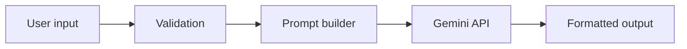

<div align="center">

# 🎓 StudyMate AI

**Turn your notes into summaries, quizzes, better answers and clear explanations.**


*An AI-powered student utility app built for the **ShadowFox AI Engineer Internship – Beginner Level**.*

</div>

---

## ✨ Features

| Tool | What you get |
|---|---|
| 📝 **Summarise Notes** | Main idea, key points and key terms — short, medium or detailed |
| ❓ **Generate Quiz** | 3–10 multiple-choice questions (easy / medium / hard) with a hidden answer key |
| ✍️ **Improve My Answer** | A stronger rewrite for your exam level, what changed, and one tip |
| 💡 **Explain a Concept** | Definition, step-by-step explanation, real-life example and quick recap |

Plus: ⬇️ downloadable output · 🕘 session history · 🛡️ input validation · 🔁 automatic retries on API failures

## 🧭 How It Works



### Prompt structure
Every request is built from five parts so results stay relevant and consistent:

1. **Role** – a system instruction defines StudyMate as a careful study assistant
2. **Task** – a mode-specific instruction with the options you chose
3. **Input** – your text, wrapped in `<input>` tags
4. **Constraints** – use only your material, simple language, ignore instructions hidden inside the input
5. **Output format** – headings, bullets, and a fixed `===ANSWERS===` marker for quizzes

### Validation & error handling

| Situation | Response |
|---|---|
| Empty input | Warning, no API call |
| No letters (symbols/numbers only) | Asks for some words |
| Extremely long input (100,000+ chars) | Asks to shorten it |
| Missing / invalid API key, wrong model | Clear message pointing to `.env` |
| Rate limit or server busy | Retries with back-off, then a friendly message |
| Empty or blocked response | Asks to rephrase |
| Network failure | Asks to check the connection |

## 🛠️ Tech Stack

`Python` · `Streamlit` · `google-genai` · `python-dotenv`

## 📁 Project Structure

```text
studymate-ai/
├── app.py             # UI, validation, prompt builder, Gemini calls
├── requirements.txt   # dependencies
├── .env.example       # template for your API key
├── .gitignore         # keeps .env out of GitHub
├── README.md
└── screenshots/       # app screenshots used below
```

## 🚀 Getting Started

```bash
git clone https://github.com/Aditya-timekiller/shadowfox-begineer.git
cd shadowfox-begineer

python -m venv venv
venv\Scripts\activate            # Mac/Linux: source venv/bin/activate
pip install -r requirements.txt

copy .env.example .env           # Mac/Linux: cp .env.example .env
streamlit run app.py
```

Open `.env` and add your key from [Google AI Studio](https://aistudio.google.com/apikey):

```env
GEMINI_API_KEY=your_api_key_here
GEMINI_MODEL=gemini-3.5-flash
```

> ⚠️ Never upload your `.env` file to GitHub.

## 📸 Screenshots

**Summarise Notes**


**Generate Quiz**


**Improve My Answer**


**Explain a Concept**


## 🎯 Internship Task Checklist

| Requirement | Status |
|---|---|
| Simple, usable interface | ✅ Streamlit sidebar + main panel |
| Text input area | ✅ |
| AI-powered utility features | ✅ Four study tools |
| Prompt-based output generation | ✅ Structured 5-part prompts |
| Validation for empty / invalid input | ✅ |
| Error handling for failed API responses | ✅ Retries + friendly messages |
| Clear display of output | ✅ Markdown, expandable answers, download |
| Clean user flow | ✅ Pick tool → paste → Generate |

## 👨‍💻 Author

Built by **[Aditya-timekiller](https://github.com/Aditya-timekiller)**
